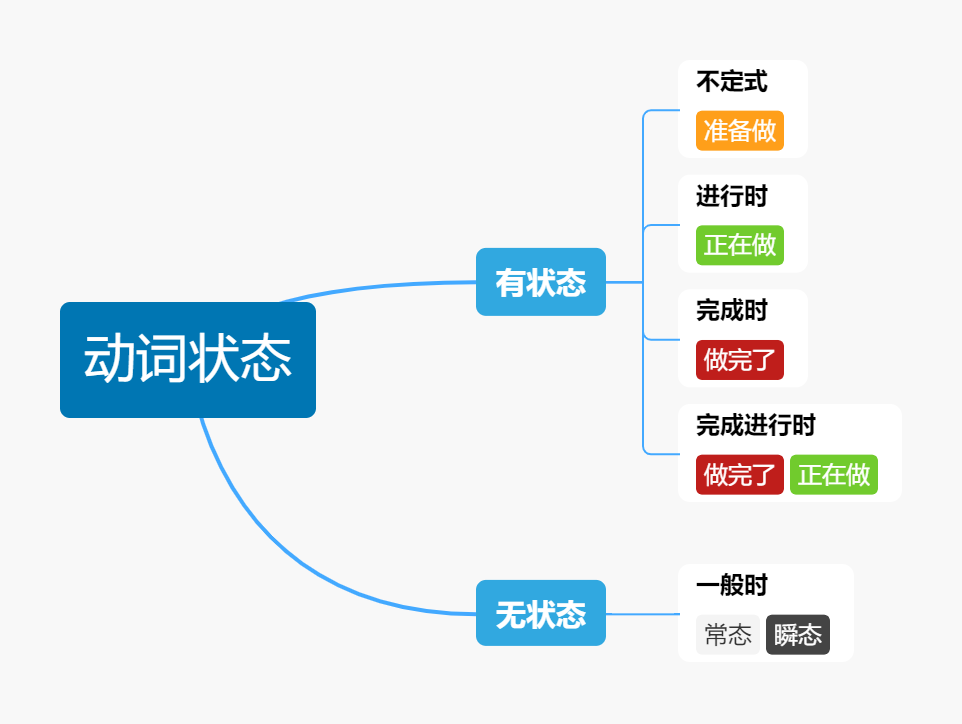

# 跟着理科生学英语

首发github，转载请保留原文链接：https://github.com/daluzhongcaoyao/english_learning/blob/main/README.md

我从小学开始学英语，学了十几年，一直是弱项，什么四六级都是低空飞行连滚带爬通过的。

但是我学其他知识都没这么惨烈啊，难道学个破英语还真需要什么天赋？

所以我下定决心，要系统学习英语的语法体系。通过大量查阅资料发现，我上学时学英语的方法，**就是狗屎！** 学校提供的教材，**都是垃圾！**

英语语法真没那么玄乎，我之前觉得难完全是因为没掌握诀窍。

我是理科生，特别不擅长记忆，但是学校的英语教材全都是零碎的细节，感觉就是咋那么多特例要背呢？纯靠死记硬背我是背了后面忘了前面，一看就会一用就废。

如果你和我一样，那你找对地方了。咱理科生就得用理科生的方法。我将语法要点用我自己的方式重新整理了，内容不多，你按我这大纲先系统学习下英语框架，然后再去看其他英语教材学习具体细节，会轻松很多。

我会按照下面这个顺序进行更新。如果觉得有用记得点star哈。~~（拜托啦，这对我真的很重要）~~

## 写在最前

从水下第一个生命的萌芽开始，到如今的信息时代。所有语言都只有一个作用：传递信息。

对于人类的语言体系，描述"变化"的词信息量最大。

在英语中，承担"变化"信息的词，叫做"动词"。

英语中的一切，都是围绕动词展开的。

语法的作用，就是告诉你，怎样用"动词"来"造句"。

记住了，**动词是英语的核心**。如果你从我这里只能带一句话出去，记住这句就行。

使用动词造句有几个基础模板，这些模板，我们称之为"简单句"。

复杂的句子，都是由简单句拼接而成。

我们会先学习简单句，再学习怎么用简单句组成复杂句，最后学习英语与汉语表达方式的差异。

## 一、简单句

简单句是使用动词造句的基础模板。也是能传递信息的最小单元。

在日常生活中，我们需要传递的信息大体上可以分为两类：

- 描述事物发生的**变化**（动态信息）
- 描述事物当前的**状态**（静态信息）

描述**变化**的简单句一共有4种模板：

| 句型 | 主语 | 谓语 | 宾语 | 宾语/补语 | 例句 |
| --- | --- | --- | --- | --- | --- |
| 主谓 | 动作发起者 | 不及物动词  |    |    | I know |
| 主谓宾 | 动作发起者 | 单及物动词  | 动作接收者 |    | I love you | 
| 主谓宾宾 | 动作发起者 | 双及物动词 | 动作接收者 | 与动作接收者互动的东西  | I gave him my book |
| 主谓宾补 | 动作发起者 | 复杂及物动词 | 动作接收者 | 动作接收者发生的变化 | I paint the wall white |

描述**状态**的简单句只有一种模板：

| 句型 | 主语 | 谓语 | 补语 |  例句 |
| --- | --- | --- | --- | --- |
| 主系表 | 被描述对象 | 连系动词  |  被描述对象现在的状态  | The wall is white |

```
表格中的什么主语宾语、及物不及物动词这些术语现在看不懂没关系。  
术语这种东西对于内行来说是降低沟通成本的，但对于外行来说这就是个门槛。我学了那么多年英语，也是直到最近才分清这些术语都是啥意思。  
我觉得我上学时听不懂老师在说什么，这些术语可能要负主要责任。  
我走过的弯路，自然不会让你再走一遍。我在正文中会尽量避免使用这些术语，如果用到了会先解释他们的含义。 
```

在我们继续之前，我们先学习2个术语："动词"和"谓语"。

动词是英语中表示动作等变化信息的"单词"。如paint, give等。一个单词是不是动词由字典决定。

谓语是"句子中"表示动作的部分。比如I paint the wall white. paint就是表示动作的部分。

句子是由单词组成的，在句子中，谓语一定是动词担任的。

英语的简单句有一条最重要的原则：**"一个简单句有且只有一个谓语动词"**。

重要的事情说三遍：

- 一个简单句最多有一个谓语动词。
- 一个简单句至少有一个谓语动词。
- 一个简单句有且只有一个谓语动词。

什么意思呢，比如：I cleaned the room，我打扫了房间。

clean就是句子中表示动作的部分。这个句子有且只有这一个动词，符合语法。

再比如：I like swim，我喜欢游泳。

这句话就有点问题了。like是表示动作的词，swim也是表示动作的词，这个句子有2个表示动作的词，不符合语法。

遇到这种情况，中文我们知道，游泳可以表示动作，也可以表示做的事情。当他表示做的事情的时候，其实是名词。

同样，英语里面也可以把动词改为名词：I like swimming.

把swim改为swimming，swimming是名词，这样句子中就只有1个动作的部分了，才算是1个正确的简单句。

动词如果在句子中作为表示动作的部分，就称为谓语动词(如上句中的like)。

如果原本是动词，却不能在句子中作为表示动作部分，就称为非谓语动词(如上句中的swimming)。

## 二、时态

时态指的就是 动词的时间 + 动词的状态

时态这个东西曾经把我弄得头秃，因为汉语有时间的概念，但是没有状态的概念。所以我们中国人造句的时候，常常只关心时间而不关心状态。

像我经常犯的错误就是把一般现在时和现在进行时弄混。

现在我来告诉你为什么，Now I tell you why.

是不是读着很顺一点都不别扭？其实这种说法是错误的，正确的说法是：Now I'm going to tell you why.

如果你犯了和我一样的错，那我们就来补课吧。我们从动词的状态开始说起。

### 2.1 动词状态

一个动作有3个阶段：还没做，正在做，做完了。

如果我们的动词要描述这3个阶段中的一个，就称为有状态。否则，就称为无状态。

有状态的情况一共3种：

| 动作阶段 | 对应状态 | 例句 |
| --- | --- | --- |
| 还没做 | 不定态(to do) | It's hard to say |
| 正在做 | 进行态(doing) | I'm coming |
| 做完了 | 完成态(done) | I have finished my work. |

有状态好理解，那无状态是什么意思呢？比如：

I think you are right. 这里的think并不对应到还没做，正在做，做完了这中间的任何一个状态，这描述的是一种**瞬态**。

I speak chinese. 这里的speak也很难对应到还没做，正在做，做完了这中间的任何一个状态，描述的是一种**常态**。

如果动词描述的是常态或瞬态，我们就称之为无状态。无状态使用一般态来表达。

> 这里说个有趣的规律。如果一个动作持续时间非常短，短到几乎是"瞬间"发生，我们用一般态表示。(The car stops，这辆车瞬间就停下了)  
> 如果这个动作重复多次，以至于会持续一段时间，我们用进行态表示。(The train is stopping，火车慢慢停下了)  
> 但是如果这个动作重复的次数非常多，以至于成为"规律"，我们又要用一般态表示。(The bus stops at every station，公交车每站都停)  

总结下，动词一共这几个状态：



你可能注意到了，图上还有个完成进行态。这是什么状态？

完成进行态并不是一个独立的状态，其实是2种状态的组合。

我们任取一个时间点，概括下这个时间点前后的状态，总共只会出现这几种情况：


所以正如其名，完成进行态=完成态+进行态。

例如，It has been snowing all day.

意思是截止到这个时间，雪**一直**在下(has been)。什么时候开始下的？不知道。而且这个雪还会**继续**下(be snowing)，什么时候结束？也不知道。这就是完成进行态。

那有没有其他的组合状态呢？

还真有，例如：I'm going to tell you why. 

be going 这是进行态，to tell 这是不定态，这其实就是一种组合状态。

只是其他的组合状态并没那么常用，所以语法书一般不收录[^不收录]。

[^不收录]: 语法书会将其视为谓语动词+非谓语动词。

### 2.2 动词时间

说完了状态我们说时间。时间很好理解，分3种：过去、现在和将来。

现在就是当前时间，现在之前的是过去时间，现在之后的是将来时间。

如果你是这么理解的，那你可能会陷入到一个哲学问题里：多久之前的时间算过去时间？

比如你在等红绿灯，然后绿灯亮了。The light turns green.

但是当你看到红绿灯变化正准备说话的时候，时间已经过去了(1秒？0.1秒？)，按照刚才的理解，这应该算过去时间啊。

所以到底是The light *turns* green 还是 The light *turned* green ？

英语语法里面的时间，其实没有这么复杂，也不会涉及到时间空间这种哲学问题。

语言的作用，就是传递信息。时间要传递的信息，就是**该时间的动作**会不会影响**现在**的决策。所以正确的理解方式是这样的：

| 时间 | 说明 |
| --- | --- | 
| 现在时间| 强调**当前适用**(注意，不是正在发生的意思)| 
| 过去时间| 强调这个事情是既成事实不可改变，并且**当前不适用**| 
| 将来时间| 强调对这个事情的态度，是非常确定，**一定会发生**| 

回到刚才的问题，是*turns* green还是*turned* green ？

这个场景里，我们在等红绿灯过马路。绿灯亮了，我们可以下决定通过马路，"当前适用"。所以是turns green。

什么时候用turned green呢？

比如：When the light turned green, we walked across the street.

这种感觉就好像在讲故事。绿灯亮了，我们穿过了马路。都是既成事实，并且不影响我现在的决策，可以用过去时间来表达。

什么时候用will turn green呢？

比如你们在红绿灯那里等了很久绿灯都没亮，小伙伴准备闯红灯了，你可以说：Be patient, The light will turn green.

意思是你相信这个灯没坏，他会变绿的。这是一种预言，一种信念，非常确定"一定会发生"。(事实是不是如此就不一定了)

以上就是英语里真实时间相关的全部内容。

你说不对啊，英语老师说时间有4种，还有个过去将来时呢？

过去将来时并不是个具体时间，是个相对时间。

常用句式类似这样：你昨天说你会帮我。You said you would help me.

这句话的主体是"You said"，这是主句。说的内容的是"you would help me"，这是从句。

过去将来时**只会出现在从句里**，并且主句一定是发生在过去时间。(一般是you said, you knew这种)

过去将来中的"将来"，指的是**相对主句**的将来。我们看这2种情景：

学霸周三答应学渣，周末会教学渣数学，"现在"是周五下午放学，学渣说 You said you would help me on the weekend. 这其实是一种"提醒"。

但是如果学霸说话不算话，周末没有去教数学，"现在"是新的周一，学渣看到学霸，然后说 You said you would help me on the weekend. 这其实是一种"责备"。

可以看出，过去将来时和现在的时间没有必然关系。而且根据说这话的现在时间，意思可能还不一样。

### 2.3 区分时间与状态

我们已经讲完了时间和状态，也画了示意图打了比方，但是这些图长得都差不多，所以你现在可能会有点懵逼：

过去和完成时，有什么区别？  
现在和进行时，有什么区别？  
将来和不定式，又有什么区别？  

那我们再复习一遍，时间和状态的区别：

时间概念，即过去/现在/将来，强调该动作当前不适用/当前适用/以后一定会发生。

状态概念，完成/进行/不定态，强调该动作做完了/正在做/还没做。一般态表示瞬态或常态。

我们对比这几个句子，你先自己理解一遍他们的区别。

He is repairing his car.  
He was reparing his car.  
He has repaired his car.  
He had repaired his car.  

看出门道了吗？3..2..1..我们继续：

He is repairing his car，状态是进行，正在做。时间是现在，当前适用。合起来就是他正在花一段时间修车，现在他没空干别的了。  
He was reparing his car，状态是进行，正在做。时间是过去，当前不适用。合起来就是他曾经花了一段时间修车，但是现在没在修了。  
He has repaired his car，状态是完成，做完了。时间是现在，当前适用。合起来就是他已经把车修好了，现在这辆车是可以用的。  
He had repaired his car，状态是完成，做完了。时间是过去，当前不适用。合起来就是他曾经把车修好了，现在这辆车是不是好的我不知道。  

可以看出时间和状态是相互独立的，时间的变化并不影响状态，状态的变化也不影响时间(数学上的术语叫正交)

既然时间和状态是相互独立的，那么我们自然就可以对他们进行排列组合：

*斜体*表示"时间"，**黑体**表示"状态"。时间在前，状态在后。

| | 不定态 | 进行态 | 完成态 | 完成进行态 | 一般态 |
| --- | --- | --- | --- | --- | --- |
| 过去时间 |*was* **to do** | *was* **doing** | *had* **done** | *had* **been doing** | *did* **do** |
| 现在时间 | *is* **to do** | *is* **doing** | *has* **done** | *has* **been doing** | *does* **do**|
| 将来时间| *will be* **to do** | *will be* **doing** | *will have* **done** | *will have* **been doing** | *will* **do** |
| 过去将来时间 | *would be* **to do** | *would be* **doing** | *would have* **done** | *would have* **been doing** |*would* **do** |

我知道你看到这张图就麻了爪了，所以不要去记这玩意儿，理解时间和状态是怎么使用的，自然就能组合出来。

例子中的be和have有些是助动词，是不能变形的。如果我用了is[^is]/has[^has]表示这里可以变形，如果用了be/have表示不能变形。
[^is]: is可以换成am/is/are，was可以换成was/were
[^has]: has可以换成have

```
吐槽下，这张表里的时态，学校的课本竟然是一个一个教的！  
而且还不告诉我他们之间有什么联系，我特么6级考完了都没搞懂这些破时态(捂脸)
```

## 三、谓语动词与非谓语动词

在简单句章节我们学过，动词如果在句子中作为表示动作的部分，就称为谓语动词，否则称为非谓语动词。

那怎么判断句子中一个动词是谓语动词还是非谓语动词呢？就一句话：

**同时包含时间+状态信息**的动词是谓语动词，只包含状态信息的动词是非谓语动词。

比如：Mom **is cooking** in the kitchen **to make** dinner.

这句话里，is cooking同时有时间信息is(现在)和状态信息cooking(进行)，是谓语动词。而to make只有状态信息(不定态)，是非谓语动词。

注意，谓语动词是is cooking这个整体，不是cook这个单词。

> 谓语动词是句子的主干部分。这句话的主干是Mom is cooking，没有干扰后很容易判断这是一个主谓结构的简单句。  
> 非谓语动词是句子的修饰部分，除了不能表示动作，表示什么都可以。你可以把他当成名词、形容词、副词...反正不是动词。这里的to make起到修饰作用，表示目的。

```
你可能好奇为什么要学习区分谓语动词与非谓语动词。主要是为了方便识别句子的主干和修饰部分。
句子越复杂，这个技巧就越重要。(看过长难句的难兄难弟纷纷表示眼里含着泪水)
```

可以看到，谓语动词与非谓语动词其实就是动词时态在句子中的应用。我们老样子，从状态开始说起。

### 3.1 非谓语动词

句子中**只包含状态信息**的动词是非谓语动词。非谓语动词是句子的修饰部分。

我们知道，动作的状态总共就3种，还没做(to do)，正在做(doing)，做完了(done)。所以非谓语动词总共也就3种：

动作阶段还没做，对应动词状态不定态，单独做非谓语动词时称为**不定式**  
动作阶段正在做，对应动词状态进行态，单独做非谓语动词时称为**现在分词**或**ing分词**，其中名词性质的现在分词又叫**动名词**  
动作阶段做完了，对应动词状态完成态，单独做非谓语动词时称为**过去分词**或**ed分词**

注意1：虽然名字叫现在分词过去分词，但他们仍然是指动作的状态，**不是动作的时间**，这点一定要注意。  
注意2：虽然名字叫ed分词，但是使用的动词变形是done变形，不是did变形。比如show的ed分词应该是shown，不是showed。

不定式含有还没做的意思，在句子中有时可以用来表示目的，如：

现在分词含有正在做的意思，在句子中

过去分词含有做完了的意思，在句子中

```
吐槽下，英语的术语真的不是用来增加学习难度的吗！一个非谓语动词整这么多术语，还特么打左灯往右拐，头都大了！!
```

### 3.2 谓语动词

句子中**同时包含时间信息和状态信息**的动词是谓语动词。谓语动词是句子的主干部分(会构成5种简单句中的一种)

状态信息我们刚刚说过了，这一节我们重点说时间信息的表达。

表示时间信息的词叫做**助动词**。助动词有3种类型：

- 普通助动词，我们在时态那个章节已经见过他们了，总共有3个(be, have, do)
- 被动语气助动词，可以将句子改为被动语气，总共就1个(be)
- 情态助动词，可以表示语气，总共不知道多少个(must, can, be able to, ...)

停停停，这里术语太多信息量太大，我知道没听懂，我们先来说说助动词

3.3 助动词


## 三、复合句

我们已经学了简单句和时态，已经可以用简单句来传递信息了。这一节我们学习怎么用简单句组装更长的句子。

### 3.1 并列复合句

### 3.2 复杂复合句（从句）

### 3.3 定语和状语

并列复合句和复杂复合句不能共存。

## 四、英语思维

我们已经学了简单句，时态和复合句，已经可以通过造句来传递信息了。接下来，我们要将句子组成段落。

如果你写过英语作文，你会发现你写出来的文章，语法可能都对，但是读起来总感觉和阅读理解里面的文章有哪里不一样。

于是你开始堆砌"高级"单词，倒装，插从句，模仿长难句写很长很长的句子，能读到断气那种。尽力了，但还是没内味儿。

其实方法是对的，只是还缺点技巧。这一节我们就来说说英语思维，并告诉你怎样使用这些方法。

首先来个热身，把这段话翻译成英文：
> TODO

不难吧，翻译下就是：
> TODO

意思都对，语法也正确。但是如果你把这样的翻译给一个英语母语的人看，他可能会皱眉头，甚至要看好几遍才能明白你的意思。

这是典型的chinglish(中式英语)，因为你的思维方式是描述"情景"的。首先确定一个中心"情景"，也就是TODO

然后围绕着这个情景展开，从方方面面去描述他。TODO -> TODO -> TODO

这就导致整个段落里，句子描述的主体一直在变。

如果换成英语国家的人，会怎么表达呢？
> TODO

句子的主体，TODO -> TODO -> TODO，是没有太大变化的。

这就是英语思维的第一个要点，主语一致

而且你看看，为了实现主语一致，是不是代词从句连接词什么的都得用起来了？

我们继续，再来一题，把这句话翻译成英文：
> 我突然想到一个好主意

也不难吧，翻译下就是：
> I suddenly got a good idea.

意思都对，语法也正确。但是，你知道我要说但是了，英语国家的人会这么翻译：
> A good idea suddenly occurred to me.

这个"occurred to"就是英语老师说的"高级"单词，但是真的高级到认不出来吗？还是说单纯只是想不到呢？

想不到的原因就在于中西表达方式有差异。中文里，我们倾向于使用有生命的物体来做动作的发起者(最常见的就是人)。

比如，**我**努力工作，**你**要提高你的英语

而英语国家的人，则更倾向于使用非生命物体来做动作的发起者。

比如，**Work** pushed me. **Your English** should be improved.

这就是英语思维的第二个要点，主语

你可以试试将你以前写的句子用这种方式改造下，很快你就发现动词的词汇量不够了，这些就是你要掌握的"高级"动词。

最后我们聊聊怎么把段落组装成全文。

中文的语言习惯，讲究一个起承转合。我们回想下领导是怎么说话的。

> (咳嗯)，最近大家学英语都很用功，已经掌握了很多语法，(停顿)，但是！还没有习惯英语思维，还需要学习这些内容： ...

这是一个迂回渐进的过程，前面说的大家都很用功这些是重点吗？不是，重点要放在最后说。"但是"后面的才是重点，也就是要继续学习。

英语的语言习惯刚好相反，先**直入主题**，再围绕主题补充论点论据。

> If you want to speak English like a native speaker, focus on the following areas: ...

这就是英语思维的第三个要点，First thing first.

另外补充说明下，注意我刚刚的说法：
> 但是，你知道我要说但是了，英语国家的人会这么翻译

这句中文里，"你知道我要说但是了"，其实英语里面也有类似的表达方式，叫做插入语。

与之类似的还有同位语。

英语思维我们就讲到这里，掌握以上这几个技巧，可以很快让你的句子变得~~复杂有逼格~~地道生动起来。

非人物做主语

为了实现这个功能，我们需要用到一些工具。

### 代词与连接词，同位语，插入语

### 标点符号

事物做主语

主语优先first thing first

## 五、让句子变复杂

到这里，你已经入门了，可以尝试着用英语来表达你的想法。接下来是进阶环节，我们要针对不同的场景学习一些特殊句式。

### 被动语态

### 虚拟语气，条件句


### 5.1 语态的特殊应用


### 倒装，强调

### 省略，祈使句

## 六、术语

到这里，你已经掌握了英语的主要框架了，接下来你将面临无穷无尽的细节。我并不打算写这些细节。

第一个原因是，这是重复造轮子。你以往看过的英语教材最不缺的就是细节，我自知卷不过他们。

二一个原因是，我懒。

但是在你走之前，我得让你有能力看懂他们的教材。这其中最大的门槛是，他们的教材不说术语都不会说话了。

我之前就一直分不清状语和副词有什么区别。看各种语法书都是晕晕乎乎的。

逃避是解决不了问题的，该面对的还是要面对。

这一章节，我们就要开始学术语啦。把主要术语理一遍，你就有能力去看他们的教材了。

### 句子成分

一个句子是由主干部分+修饰部分组成

主干部分

主谓宾补表

动作发起者或被描述对象是主语

表示动作的部分是谓语，需要同时有时间+状态信息

修饰部分，定语状语

定语修饰名词，其他的都是状语

### 词性

## 七、扩大你的词汇量

到这里，英语语法你已经学的七七八八了。但是你去阅读/考试，可能发现还是寸步难行。

为啥？巧妇难为无米之炊，词汇量不够。一个句子只认识am is are，能看懂才怪咧。

可惜词汇量这玩意儿是慢功夫，我也没什么外挂可以让你立即变得无敌。

当然技巧是有的，只不过有些人觉得相见恨晚，有些人觉得多此一举。

我都放在这里了，都是些老生常谈的东西，能不能帮你突破就看造化了。

构词法与读法

先背动词

介词与动词短语

---

以上就是英语语法概述的全部内容了，希望能够对你有所帮助。

如果感觉**念头通达**，还请帮忙点个小小的star，谢谢！

## 参考资料

### 强烈推荐

【B站】【英语兔】[一个视频说清整个英语语法体系(重塑你的语法认知框架)](https://www.bilibili.com/video/BV1r54y1m7gd)

【B站】【颉斌斌老师】[考研长难句突破技术（颉斌斌老师考研长难句66句精讲背诵班18讲完整版）](https://www.bilibili.com/video/BV1oA411Y7PU)

【书籍】【谢瑞】[英语思维-解密英语语法的原理](https://item.jd.com/12955608.html)(华东理工大学出版社)

### 其他参考资料

【知乎】【赛门喵Simon】[如何忘掉汉语，进入真正的英语思维？](https://www.zhihu.com/question/21163865)

【知乎】【邱奶酪】[为什么有些英语老师说语法几个小时就可以讲明白？](https://www.zhihu.com/question/30030877)

【书籍】【旋元佑】英语魔法师之语法俱乐部(九州出版社)

【书籍】【张满胜】英语语法新思维(初级，中级，高级教程)(群言出版社)

【书籍】【Norman Lewis】Word Power Made Easy

【书籍】【Mary Wood Cornog】Merriam-Webster's Vocabulary Builder

【github】【skywind3000】[ECDICT](https://github.com/skywind3000/ECDICT)

【APP】【高伟东】[词根词缀字典](http://www.dicts.cn/)

| | 过去时间 | 现在时间 | 将来时间 | 过去将来时间 |
| --- | --- | --- | --- | --- |
| 不定态 | *was* **to do** | *is* **to do** | *will be* **to do** | *would be* **to do** |
| 进行态 | *was* **doing** | *is* **doing** | *will be* **doing** | *would be* **doing** |
| 完成态 | *had* **done** | *has* **done** | *will have* **done** | *would have* **done** |
| 完成进行态 | *had* **been doing** | *has* **been doing** | *will have* **been doing** | *would have* **been doing** |
| 一般态 | *did* **do** | *does* **do** | *will* **do** | *would* **do** |
