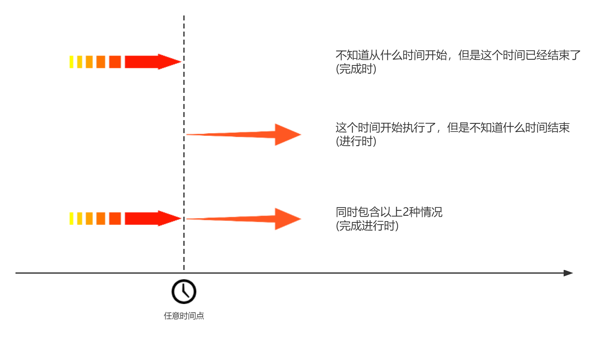

# 跟着理科生学英语
我从小学开始学英语，学了十几年，一直是弱项，什么四六级都是低空飞行连滚带爬通过的。

但是我学其他知识都是半年一年就能搞定的啊，难道学个破英语还真需要什么天赋？

所以我下定决心，要系统学习英语的语法体系。通过大量查阅资料发现，我上学时学英语的方法，**就是狗屎！** 学校提供的教材，**都是垃圾！**

英语语法真没那么玄乎，我之前觉得难完全是因为没掌握诀窍。

我是理科生，特别不擅长记忆，但是学校的英语教材就是眉毛胡子一把抓，全都是零碎的细节。纯靠死记硬背我是背了后面忘了前面，一看就会一用就废。

如果你和我一样，那你找对地方了。咱理科生就得用理科生的方法。我将语法要点用我自己的方式重新整理了，内容不多，你按我这大纲先系统学习下英语框架，然后再去看其他英语教材学习具体细节，会轻松很多。

我会按照下面这个顺序进行更新。如果觉得有用记得点赞哈。~~（拜托啦，这对我真的很重要）~~

## 写在最前
从水下第一个生命的萌芽开始，到如今的信息时代。所有语言都只有一个作用：传递信息。

对于人类的语言体系，描述"变化"的词信息量最大。

在英语中，承担"变化"信息的词，叫做**"动词"**。

英语中的一切，都是围绕动词展开的。

语法的作用，就是告诉你，怎样用"动词"来"造句"。

记住了，**动词是英语的核心**。如果你从我这里只能带一句话出去，记住这句就行。

使用动词造句有几个基础模板，这些模板，我们称之为"简单句"。

复杂的句子，都是由简单句拼接而成。

我们会先学习简单句，再学习怎么用简单句组成复杂句，最后学习英语与汉语表达方式的差异。

## 一、简单句

简单句是使用动词造句的基础模板。也是能传递信息的最小单元。

在日常生活中，我们需要传递的信息大体上可以分为两类：

- 描述事物发生的**变化**（动态信息）
- 描述事物当前的**状态**（静态信息）

描述**变化**的简单句一共有4种模板：

| 句型 | 主语 | 谓语 | 宾语 | 宾语/补语 |
| --- | --- | --- | --- | --- |
| 主谓 | 动作发起者 | 不及物动词  |    |    | 
| 主谓宾 | 动作发起者 | 单及物动词  | 动作接收者 |    | 
| 主谓宾宾 | 动作发起者 | 双及物动词 | 动作接收者 | 动作接收者收到的东西  | 
| 主谓宾补 | 动作发起者 | 复杂及物动词 | 动作接收者 | 动作接收者发生的变化 | 

描述**状态**的简单句只有一种模板：

| 句型 | 主语 | 谓语 | 补语 | 
| --- | --- | --- | --- | 
| 主系表 | 被描述对象 | 连系动词  |  被描述对象现在的状态  | 

表格中的什么主语谓语、及物不及物动词这些术语现在看不懂没关系。

术语这种东西对于内行来说是降低沟通成本的，但对于外行来说这就是个门槛。我学了那么多年英语，也是直到最近才分清这些术语都是啥意思。

我觉得我上学时听不懂老师在说什么，这些术语可能要负主要责任。

我走过的弯路，自然不会让你们再走一遍。我在正文中会尽量避免使用这些术语，并慢慢解释他们的含义。

简单句概述

主谓宾

## 二、时态
时态指的就是 时间 + 状态。
> 完整描述是： 动词的时间 + 动词的状态

时态这个东西曾经把我弄得头秃，因为汉语有时间的概念，但是没有状态的概念。所以我们中国人造句的时候，常常只关心时间而不关心状态。

像我经常犯的错误就是把一般现在时和现在进行时弄混。

现在我来告诉你为什么，I tell you why.

是不是读着很顺一点都不别扭？其实这种说法是错误的，正确的说法是：
> I'm going to tell you why.

如果你犯了和我一样的错，那我们就来补课吧。我们从状态开始说起。

### 2.1 状态
一个动作有3个阶段：还没做，正在做，做完了。

如果我们的动词要描述这3个阶段中的一个，就称为有状态。否则，就称为无状态。

有状态的情况一共3种：

| 动作阶段 | 对应状态 | 例句 |
| --- | --- | --- |
| 还没做 | 不定式 | It's hard to say |
| 正在做 | 进行时 | I'm coming |
| 做完了 | 完成时 | I have finished my work. |

有状态好理解，那无状态是什么意思呢？比如：

I think you are right. 这里的think并不对应到还没做，正在做，做完了这中间的任何一个状态，这描述的是一种**瞬态**

I speak chinese. 这里的speak也很难对应到还没做，正在做，做完了这中间的任何一个状态，描述的是一种**常态**。

如果动词描述的是常态或瞬态，我们就称之为无状态。

总结下，动词一共这几个状态：

你可能注意到了，图上还有个完成进行时。这是什么状态？

完成进行时并不是一个独立的状态，其实是2种状态的组合。

我们任取一个时间点，概括下这个时间点前后的状态，总共只会出现这几种情况：

所以人如其名，完成进行时=完成时+进行时。

那有没有其他的组合状态呢？

还真有，比如：

> I'm going to tell you why. 

be going 这是进行时，to tell 这是不定式，这其实就是一种组合状态。

只是其他的组合状态并没那么常用，所以中学的语法书一般不收录。

### 2.2 时间

说完了状态我们说时间。时间很好理解，分3种：过去、现在和将来。

你说不对啊，英语老师说有4种，还有个过去将来时呢？

好吧，那我们还是老办法，分类吧。

### 2.3 区分时间与状态

过去，完成时

现在，进行时

将来，不定式

时间和状态是相互独立的，时间的变化并不影响状态，状态的变化也不影响时间(数学上的术语叫正交)

既然时间和状态是相互独立的，那么我们自然就可以对他们进行排列组合：

*斜体*表示"时"，**黑体**表示"态"

例子中的be和have有些是助动词，是不能变形的。如果我用了is[^is]/has[^has]表示这里可以变形，如果用了be/have表示不能变形。
[^is]: is可以换成am/is/are，was可以换成was/were
[^has]: has可以换成have
 
| | 过去时间 | 现在时间 | 将来时间 | 过去将来时间 |
| --- | --- | --- | --- | --- |
| 不定态 | *was* **to do** | *is* **to do** | *will be* **to do** | *would be* **to do** |
| 进行态 | *was* **doing** | *is* **doing** | *will be* **doing** | *would be* **doing** |
| 完成态 | *had* **done** | *has* **done** | *will have* **done** | *would have* **done** |
| 完成进行态 | *had* **been doing** | *has* **been doing** | *will have* **been doing** | *would have* **been doing** |
| 一般态 | *did* **do** | *does* **do** | *will* **do** | *would* **do** |

我知道你看到这张图就麻了爪了，所以不要去记这玩意儿，理解时间和状态是怎么使用的，自然就能组合出来。

> 吐槽下，这张表里的时态，中学的课本可是一个一个教的啊！

> 而且还不告诉我他们之间有什么联系，我特么6级考完了都没搞懂这些破时态(捂脸)

### 2.3 语态的特殊应用

虚拟语气

## 三、复合句

### 3.1 并列复合句

### 3.2 复杂复合句（从句）

## 四、让句子变复杂

### 代词与连接词

### 插入语、同位语

### 倒装

### 省略

### 标点符号

## 五、英语思维

## 六、术语
到这里，你已经掌握了英语的主要框架了，接下来你将面临无穷无尽的细节。我并不打算写这些细节。

头一个原因是，这是重复造轮子，你以往看过的英语教材最不缺的就是细节，我自知卷不过他们。

二一个原因是，我懒。

但是在你走之前，我得让你有能力看懂他们的教材。这其中最大的门槛是，他们的教材不说术语都不会说话了。

我之前就一直分不清状语和副词有什么区别。看各种语法书都是晕晕乎乎的。

逃避是解决不了问题的，该面对的还是要面对。

这一章节，我们就要开始学术语啦。把各种术语都理一遍，然后你就有能力去看外面的教材了。

另外虽说我不打算陷入到细节中，但是一些四两拨千斤的技巧我还是会提到。所以建议还是快速过一遍，能记住最好，记不住的话用到的时候再来查吧。

### 句子成分

### 词性

## 七、扩大你的词汇量
到这里，英语语法你已经学的七七八八了。但是你去阅读/考试，可能发现还是寸步难行。

为啥？巧妇难为无米之炊，词汇量不够。一个句子只认识am is are，能看懂才怪咧。

可惜词汇量这玩意儿是慢功夫，我也没什么外挂可以让你立即变得无敌。

当然技巧是有的，只不过有些人觉得相见恨晚，有些人觉得多此一举。

我都放在这里了，都是些老生常谈的东西，能不能帮你突破就看造化了。

构词法

介词与动词短语

